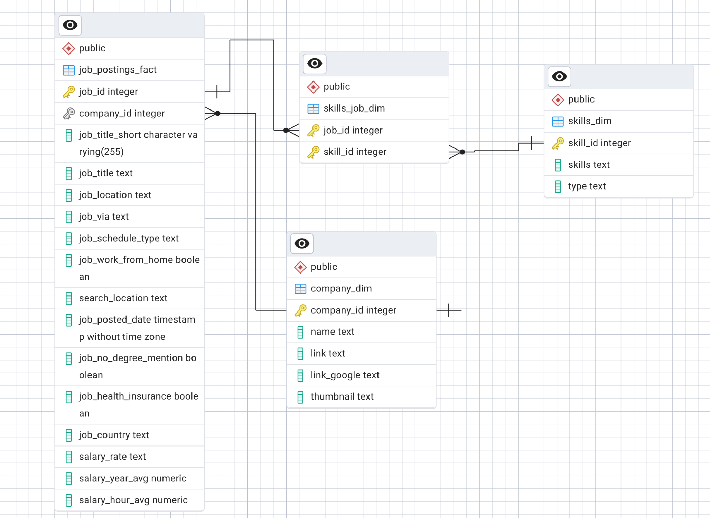
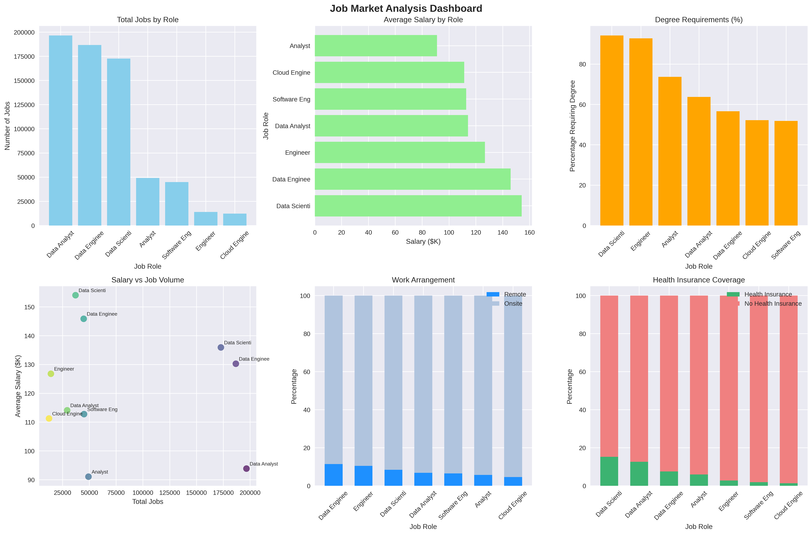
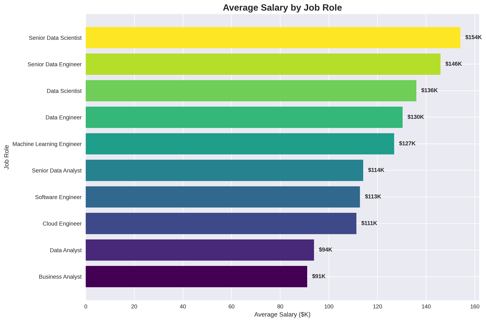
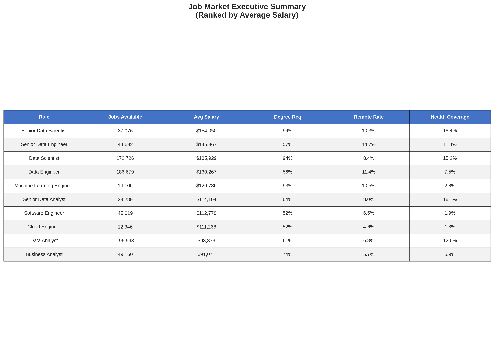

# Job Market Analysis Project

A comprehensive data analysis project examining job market trends, company hiring patterns, and skill demands in the tech industry using SQL for data extraction and Python for visualization.

## Project Overview

This project analyzes a comprehensive job postings dataset to provide insights into:
- Job market volume and trends across different roles
- Salary distributions and compensation analysis  
- Company hiring patterns and specializations
- Skill demand analysis across job categories
- Remote work opportunities and benefits analysis
- Educational requirements across different positions

## Project Structure

```
job-market-analysis/
.
├── data
│   ├── csv_files
│   │   .csv # for populating the data base 
│   └── sql_load  
│       ├── 1_create_database.sql
│       ├── 2_create_tables.sql
│       └── 3_modify_tables.sql
├── python_visualization
│   ├── companies.py
│   ├── exploration.py
│   ├── jobs.py
│   └── skills.py
├── query_results
│    .csv ...
├── README.md
├── report
│   ├── figures
│   │    ...
│   ├── latex_template.tex
│   └── report.pdf
└── sql_queries
    ├── companies.sql
    ├── exploration.sql
    ├── jobs.sql
    ├── project.session.sql
    └── skills.sql
```

## Technologies Used

### Data Analysis
- **SQL**: PostgreSQL for complex data queries and aggregations
- **Python**: Data processing and analysis
- **Pandas**: Data manipulation and analysis
- **NumPy**: Numerical computations

### Visualization
- **Matplotlib**: Static visualizations and publication-quality plots
- **Seaborn**: Statistical data visualization

## Dataset Information

The dataset contains job postings data with the following key metrics:
- **Time Range**: Multi-year job posting data
- **Geographic Coverage**: Multiple countries with focus on major markets
- **Data Sources**: Aggregated from major job posting websites
- **Job Categories**: Tech roles including data science, engineering, analysis, and cloud computing

### Key Tables
- [`company_dim.csv`](data/csv_files/company_dim.csv): Company information and details  
- [`job_postings_fact.csv`](data/csv_files/job_postings_fact.csv): Main job postings data
- [`skills_dim.csv`](data/csv_files/skills_dim.csv): Skills and competency data
- [`skills_job_dim.csv`](data/csv_files/skills_job_dim.csv): Job-skill relationship mapping

## Setup Instructions

### Prerequisites
```bash
pip install pandas matplotlib seaborn numpy pathlib
```

### Database Setup
1. Set up PostgreSQL database
2. Run the setup scripts in order:
   ```sql
   -- Execute in sequence:
   psql -f data/sql_load/1_create_database.sql
   psql -f data/sql_load/2_create_tables.sql  
   psql -f data/sql_load/3_modify_tables.sql
   ```
3. Load the CSV data into the created tables

_if you followed the steps correctly you should have this schema_

### Running the Analysis
Execute the SQL queries in logical order:
```sql
-- 1. Dataset exploration
psql -f sql_queries/exploration.sql

-- 2. Job market analysis  
psql -f sql_queries/jobs.sql

-- 3. Skills demand analysis
psql -f sql_queries/skills.sql

-- 4. Company patterns analysis
psql -f sql_queries/companies.sql
```

### Generating Visualizations
```bash
# Generate job market visualizations
python python_visualization/jobs.py

# Generate company analysis charts
python python_visualization/companies.py

# Generate exploration charts
python python_visualization/exploration.py

# Generate skills analysis
python python_visualization/skills.py
```

## Analysis Results

### Job Market Overview
 



*Comprehensive 6-panel dashboard showing **job volume**, **salary distribution**, **degree requirements**,** remote work opportunities**, and **health insurance** coverage across tech roles*

### Salary Analysis

*Average salary comparison revealing significant compensation gaps between roles, with Data roles almost dominating premium salaries*

### Company Hiring Patterns

*Top 100 companies leading machine learning recruitment, we have not seen Tech giants like Google at the top because the data contains very few ML jobs compared to Data that's why it's not very representative*

### Skills Demand

*Most in-demand technical skills across job categories, highlighting the dominance of **SQL**, **Python** for almost all job roles*

### Executive Summary

*Complete market overview table with job availability, salary ranges, degree requirements, remote work rates, and health coverage by role*

## Additional Analysis

For detailed analysis, see the complete visualization set in [`report/figures/`](report/figures/):
- **Dataset Exploration**: Geographic distribution, temporal trends, data source analysis
- **Job Volume Analysis**: Market size by role and hiring volume trends  
- **Benefits Analysis**: Remote work opportunities, health insurance, education requirements
- **Company Analysis**: Hiring patterns across all job categories, ML specialization analysis
- **Skills Analysis**: Skill category distribution and competency mapping
 

## Key Findings

1. **Geographic Distribution**: US dominates the job market by a significant margin, followed by India, UK, France, and Germany in descending order

2. **Compensation Tiers**: Data roles command the highest salaries with substantial premiums over software and cloud positions, particularly at senior levels. Note: Dataset shows bias toward data-related positions, which may skew this comparison

3. **Skills Demand**: Python emerges as the de facto standard across all roles, with SQL appearing as a near-universal requirement in job postings

4. **Benefits Trends**: Remote work opportunities remain consistent across roles at approximately 8% average, with health insurance coverage maintaining similar rates

5. **Company Patterns**: Tech giants lead in specialized role hiring while smaller companies focus on generalist positions
## Business Applications

This analysis provides valuable insights for:
- **Job Seekers**: Understanding market demand, salary expectations, and skill requirements
- **Employers**: Benchmarking compensation, identifying talent pools, and skill gap analysis  
- **Recruiters**: Market intelligence and candidate sourcing strategies


## Future Enhancements

- Time series forecasting for trend prediction
- Geographic salary variation deep dive
- Industry-specific specialization analysis
- Real-time data pipeline integration
- Predictive modeling for salary and demand forecasting